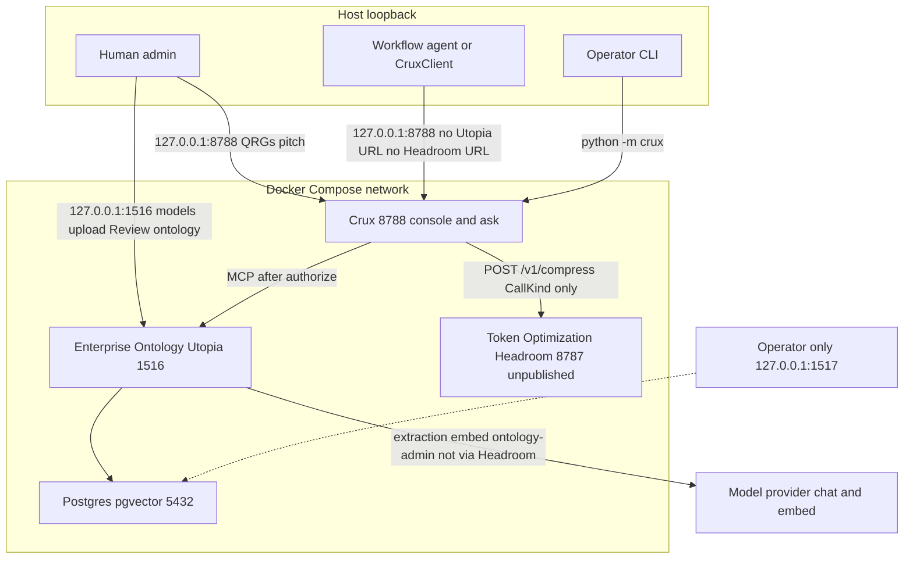
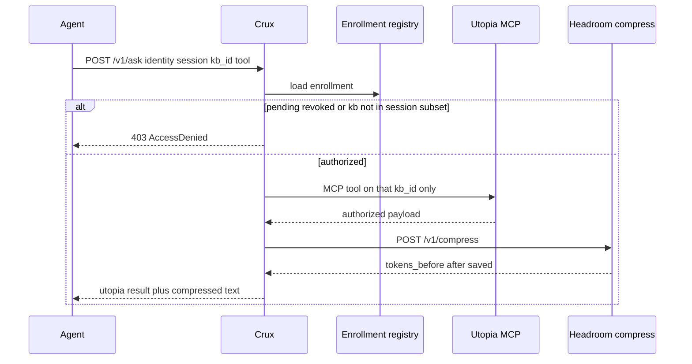

# Architecture

Release A packaging. Crux is the product. Enterprise Ontology (Utopia) authorizes knowledge. Token Optimization (Headroom) compresses only after that. There is no third ACL.

Locked decisions: [docs/adr/](adr/). File map: [CODEMAP.md](CODEMAP.md). Health: [STATUS.md](STATUS.md).

Effective access:

```
Utopia grants ∩ credential ∩ session subset of those grants
```

Session can only restrict. Production asking Staging is 403. `remember` is propose → Review, not a live graph edge.

## Deployment

Who can reach what. Headroom has no host port. Postgres is operator-only. Agents never receive Headroom or database credentials.



Do not point Utopia `chat_base_url` at Headroom. Extraction, embeddings, and ontology-admin stay on the provider (trusted `CallKind` bypass, not a request header).

## Ask path

The combined product: credential → authorize → Utopia MCP → Headroom compress.



## Two modules

```mermaid
flowchart LR
  subgraph ontology [Crux Enterprise Ontology]
    bases[Production and Staging restricted bases]
    review[Review queue]
    graph[Graph extract]
    policy[Roles tokens membership]
  end

  subgraph tokens [Crux Token Optimization]
    compress["POST /v1/compress"]
    bypass[CallKind bypass extract embed admin]
  end

  subgraph glue [Crux packaging]
    enroll[Enroll revoke session]
    audit[Audit arg keys only]
    console[Operator console]
  end

  glue --> ontology
  ontology -->|"authorized payload"| tokens
```

## Surfaces

| Bind | What |
|---|---|
| `127.0.0.1:8788` | Agent port, operator console, QRGs, pitch |
| `127.0.0.1:1516` | Human Ontology UI |
| `127.0.0.1:1517` | Postgres, operators only |
| Headroom `:8787` | Compose-internal only |

Audit covers instrumented MCP only. Native shell, file, and independent HTTP are not in the audit claim.
